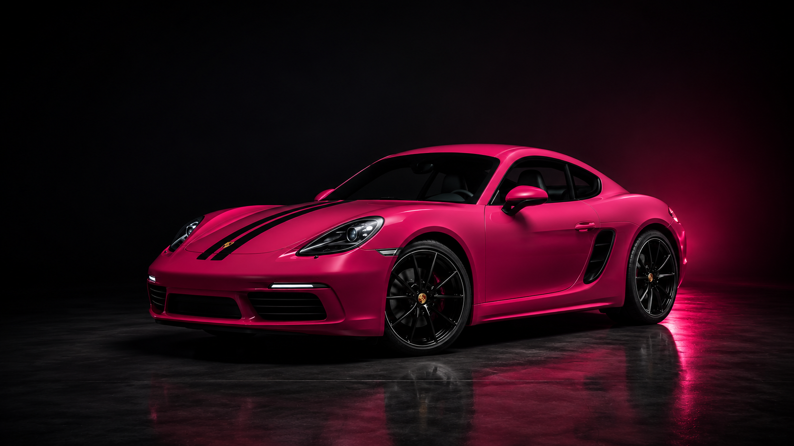

# 🏎️ Porsche 718 Cayman Style Edition — Interactive Concept

> **A high-performance, 409-frame cinematic scrollytelling web experience built for the iconic Porsche 718 Cayman Style Edition.**



---

## 🌟 Overview

**Porsche 718 Cayman Concept** is a luxury automotive web showcase designed to give users an immersive, interactive 360° cinematic experience of the Porsche 718 Cayman. Featuring **409 ultra-high-definition rendered frames**, real-time Canvas scrollytelling, dynamic paint customizers, interactive feature hotspots, and realistic engine sound effects.

---

## ✨ Key Features

- **🎞️ 409-Frame Canvas Scrollytelling**: Ultra-smooth 60 FPS frame sequence rendered onto an HTML5 Canvas, seamlessly bound to user scroll depth.
- **🎨 Dynamic Color Customizer**: Live interactive color switcher featuring authentic Porsche exterior shades:
  - 💖 **Ruby Star Neo** (Signature)
  - 💙 **Gentian Blue Metallic**
  - 💛 **Racing Yellow**
  - 🌸 **Frozen Berry Metallic**
  - 🖤 **Crayon / Chalk Gray**
- **🎯 Interactive Tech Hotspots**: Clickable feature cards highlighting:
  - **Mid-Engine Chassis**: 2.0L Turbocharged Boxer-4 producing 300 HP.
  - **Sport Exhaust System**: Dual central black tailpipes with dynamic sound profile.
  - **Porsche Active Suspension Management (PASM)**: Precision ride height control.
  - **Style Edition Package**: 20-inch 718 Spyder wheels in high-gloss white/black.
- **🔊 Immersive Audio Engine**: Interactive sound toggle simulating authentic Porsche boxer engine revs.
- **📱 Responsive Glassmorphic UI**: Sleek dark mode design system with glassmorphism overlays, custom scrollbars, and modern typography (*Outfit* & *Inter*).

---

## 🛠️ Technology Stack

| Category | Technology |
| :--- | :--- |
| **Markup & Layout** | HTML5 (Semantic Structure) |
| **Logic & Rendering** | Vanilla JavaScript (ES6+), HTML5 Canvas API |
| **Styling** | Vanilla CSS3 (Design Tokens, `@property` Animation, Glassmorphism) |
| **Typography** | Google Fonts (*Outfit*, *Inter*) |
| **Assets** | 409 PNG Animation Frames, High-Res Hero Renderings |

---

## 📂 Project Structure

```text
porsche-cayman-concept/
├── assets/
│   └── hero.png          # High-resolution showcase hero image
├── frames/
│   ├── frame_0001.png    # 360-degree animation frame 001
│   ├── ...               # [409 high-definition PNG frames]
│   ├── frame_0409.png    # 360-degree animation frame 409
│   └── frames.json       # Frame configuration manifest
├── index.html            # Main markup & embedded styling system
├── main.js               # Canvas loader, scroll controller & UI logic
├── LICENSE               # MIT License
└── README.md             # Project documentation
```

---

## 🚀 Quick Start

To preview or run this project locally on your machine:

1. **Clone the Repository**:
   ```bash
   git clone https://github.com/Hemal0651/porsche-cayman-concept.git
   ```

2. **Navigate into the directory**:
   ```bash
   cd porsche-cayman-concept
   ```

3. **Open in Browser**:
   - Simply open `index.html` in any modern web browser (Google Chrome, Microsoft Edge, Safari, Firefox).
   - Alternatively, launch using VS Code Live Server or `npx serve`.

---

## 📄 License

This project is licensed under the [MIT License](./LICENSE).

---

<p center align="center">
  Crafted with ❤️ by <a href="https://github.com/Hemal0651"><strong>Hemal0651</strong></a>
</p>
